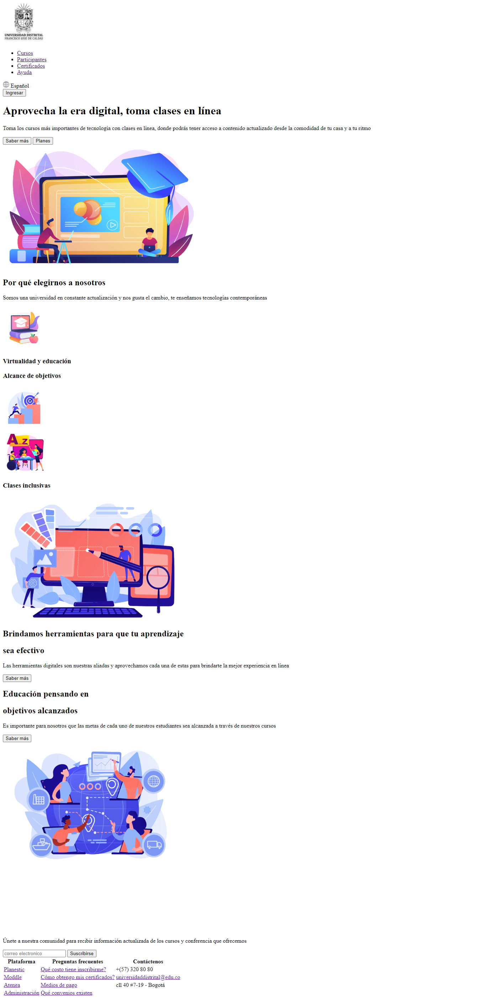
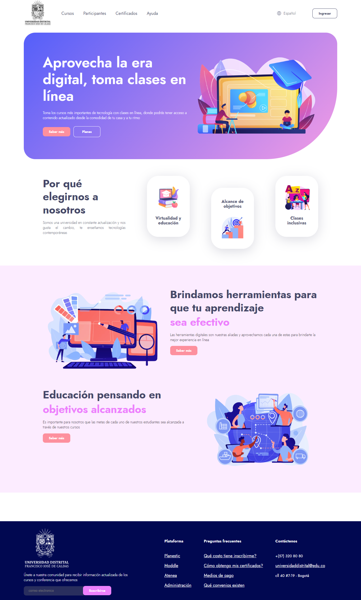

<h1>Taller 9: Gabriela Pinzon</h1>

<h2>Informacion<h/2>

Curso Full Stack Básico - Grupo 1

Profesor: Cristian Patiño

<h2>Punto 1: Link de figma </h2>
<a href=https://www.figma.com/file/r0UaMMck7IJ2FfSymckbJY/Ailihg-Gabriela-FIGMA?typedesign&node-id0%3A1&modedesign&t5chzbhs5g9v9q1Oe-1>Link de Figma</a>

<h2>Punto 2 HTML <h2>

<h2>Punto 3 CSS <h2>

<h2>Punto 4 Titulos<h2>

<h2>Punto 5 Parrafo<h2>

<h2>Punto 6 Links<h2>

<h2>Punto 7,8 Button<h2>

<h2>Punto 9 Table<h2>
